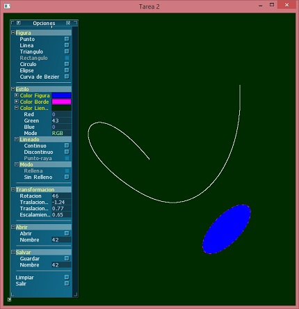

# Bezier Curve
This is a project created by Alejandro Sans for a Computer Graphic course (Universidad Central de Venezuela). 

This projects allow the user to create figures: point, lines, triangle, rectangle, circle, ellipse and Bézier Curve. You can change the color, draw it filled, and apply transformation on the figures. It also allows you to save and load any image you have

# Compiling

This project requires compiling with visual studio 2015 and the following external libraries:

* [FreeGLUT] 3.0.0-2
* [AntTweakBar] 1.16

To compile in visual studio, the header files must be on a "tools" folder that must be created in the forlder "BezierCurves/Tarea 2". The Header should be included as follow:

    - BezierCurves/Tarea 2/tools/GL/ (freeglut headers)
    - BezierCurves/Tarea 2/tools/AntTweakBar/ (AntTweakBar)

The libraries must be on a folder "lib" that must be created in the folder "BezierCurves/Tarea 2" as follow:
    - BezierCurves/Tarea 2/lib

And the dll should be include on the compilation folder, in "BezierCurves/Tarea 2"

# Image

Here is an image of the application

   [video]: <https://vimeo.com/37664294>
   [SDL]: <https://www.libsdl.org/>
   [SDL_mixer]: <https://www.libsdl.org/projects/SDL_mixer/>
   [FreeGLUT]: <http://freeglut.sourceforge.net/>
   [FreeImage]: <http://freeimage.sourceforge.net/>
   [AntTweakBar]: <http://anttweakbar.sourceforge.net/doc/>
